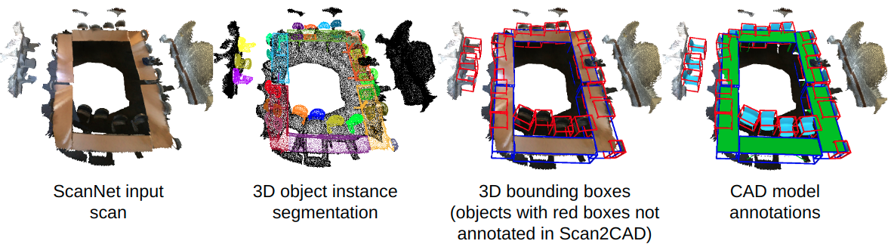
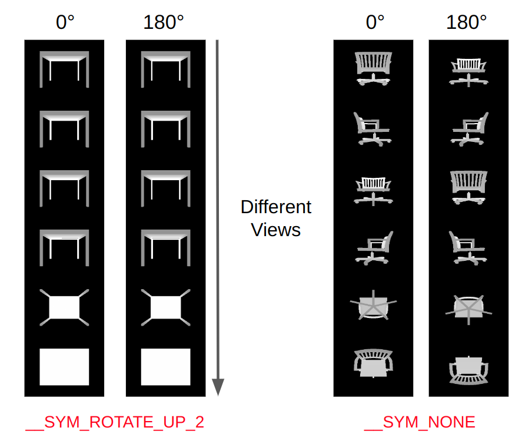

# SCANnotateDataset
CAD model and pose annotations for objects in the ScanNet dataset. Annotations are automatically generated 
using [scannotate](https://github.com/stefan-ainetter/SCANnotate) and [HOC-Search](https://arxiv.org/abs/2309.06107). 
The quality of these annotations was verified in several verification passes, 
with manual re-annotations performed for outliers to ensure that final annotations are of high quality. 

<p align="center">

</p>

## Details about Annotations

For the public [ScanNet dataset](http://www.scan-net.org/), we provide:

* `18617` CAD model annotations for objects in the ScanNet dataset (30% more annotated objects compared to [Scan2CAD](https://github.com/skanti/Scan2CAD))
* Accurate 9D pose for each CAD model
* 3D semantic object instance segmentation corresponding to the annotated objects
* Automatically generated symmetry tags for ShapeNet CAD models for all categories present in ScanNet
* Extracted view parameters (selected RGB-D images and camera poses) for each object, which
can be used for CAD model retrieval via render-and-compare

## CAD Model and Pose Annotations
Our annotations for ScanNet are provided as `.pkl` files, which 
contain additional information about the annotated objects, e.g. view parameters for render-and-compare and the 
corresponding 3D instance segmentation of the pointcloud data.

For convenience, we additionally provide the annotations as `.json` file using the scan2cad data format. 

**Note** that in order to use any of the provided annotations correctly, you have to preprocess the ShapeNet 
CAD models (center and scale-normalize all CAD models) as explained below, 
to generate clean CAD models which are then compatible with our annotations.


### Preliminaries: Download ShapeNet and ScanNet examples
* Download the ScanNet example scene [here](https://files.icg.tugraz.at/f/5b1b756a78bb457aafb5/?dl=1). Extract the data
and copy them to `/data/ScanNet/scans`. Note that by downloading this example data
you agree to the [ScanNet Terms of Use](https://kaldir.vc.in.tum.de/scannet/ScanNet_TOS.pdf). 
To download the full ScanNet dataset follow the instructions on the [ScanNet GitHub page](https://github.com/ScanNet/ScanNet).

* Download the [ShapenetV2](https://shapenet.org/) dataset by signing up
on the website. Extract ShapeNetCore.v2.zip to `/data/ShapeNet`.

* Download our annotations for the full ScanNet dataset 
[here](https://files.icg.tugraz.at/f/2cc86896b0e4433a81ce/?dl=1). Extract the data and copy them to
`/data/ScanNet/annotations`.

#### Preprocessing ShapeNet CAD Models
To center and scale-normalize the downloaded ShapeNet CAD models, run:
```bash
bash run_shapenet_prepro.sh gpu=0
```
The `gpu` argument specifies which GPU should be used for processing. 
By default, code is executed on CPU.

After the above-mentioned steps the `/data` folder should contain the following directories:
```text
- data
    - ScanNet
        - annotations
            - scene0495_00
            - ...
        - scans
            - scene0495_00
    - ShapeNet
        - ShapeNet_preprocessed            
        - ShapeNetCore.v2
```

#### Installation Requirements and Setup

* Clone this repository. Install PyTorch3D by following the instructions from the
[official installation guide](https://github.com/facebookresearch/pytorch3d/blob/main/INSTALL.md).

After installing Pytorch3D, run the following command:
```bash
pip install scikit-image matplotlib imageio plotly opencv-python open3d trimesh==3.10.2
```

### Annotations in Scan2CAD data format
Annotations in scan2cad format are available [here](https://files.icg.tugraz.at/f/aaaf656e64014745af15/?dl=1).
The file `full_annotions_scannotate.json` contains `1513` entries, where the field of one entry is described as:
```javascript
[{
id_scan : "scannet scene id",
trs : { // <-- transformation from scan space to world space 

    translation : [tx, ty, tz], // <-- translation vector
    rotation : [qw, qx, qy, qz], // <-- rotation quaternion
    scale :  [sx, sy, sz], // <-- scale vector
    },
aligned_models : [{ // <-- list of aligned models for this scene
    sym : "(__SYM_NONE, __SYM_ROTATE_UP_2, __SYM_ROTATE_UP_4 or __SYM_ROTATE_UP_INF)", // <-- symmetry property only one applies
    catid_cad  : "shapenet category id",
    id_cad : "shapenet model id",
    category_name : "", // e.g. chair,
    trs : { // <-- transformation from CAD space to world space 
        translation : [tx, ty, tz], // <-- translation vector
        rotation : [qw, qx, qy, qz], // <-- rotation quaternion
        scale : [sx, sy, sz] // <-- scale vector
	},
    keypoints_scan : {}, // no keypoints in our annotations
    keypoints_cad : {}, // no keypoints in our annotations
    scannet_category_label: "", // e.g. chair; this label is taken from original ScanNet 3D object instance segmentation
    object_id: "", // unique id for each annotated object in the scene
    is_in_scan2cad: // <-- True if CAD annotation is available in scan2cad, else False
    }]
},
{ ... },
{ ... },
]
```


### Visualization of Annotations
Use the following command to visualize the annotations: 
```bash
bash visualize_annotations.sh
```

## ShapeNet Object Symmetry Annotations
Automatically generated symmetry tags for all CAD models of considered categories are available for download 
[here](https://files.icg.tugraz.at/f/58469ba8edbd419abb6d/?dl=1). Symmetry
tags are saved in the following format:
```javascript
[{
    cad_symmetry_dict: {  // Symmetry Tags for CAD models
        synset_id: { // shapenet category id, 
            category_name: "", // e.g. chair,
            synset_id: "",
            object_sym_dict: { // <-- dictionary containing CAD model ids and corresponding symmetry tags
                'id_cad': 'symmetry_tag',
            },
    {...},
    {...},
}
}
}]
```

To predict the symmetry tag for a given CAD model, we first render depth maps from 6 different views of the 
preprocessed CAD model. 
We then rotate the object around the vertical axis by a specific angle (e.g. 180° to check for 
__SYM_ROTATE_UP_2), and again render the depth maps of the 6 views. If the difference of depth renderings is below a 
certain threshold, we assume that the object is symmetric according to the performed rotation.

<p align="center">

</p>

## Changelog
***
### 2024-02-11
#### Fixed
- Frame IDs in view parameters sometimes contained the ID ' ', which should actually be ID '0'. Annotation file has been 
corrected accordingly and is available via the [download link](https://files.icg.tugraz.at/f/2cc86896b0e4433a81ce/?dl=1).

## Citation
To create these annotations, we used the CAD model retrieval pipeline from 
[scannotate](https://github.com/stefan-ainetter/SCANnotate), but replaced the exhaustive
CAD retrieval stage with [HOC-Search](https://arxiv.org/abs/2309.06107). 
If you use any of the provided code or data, please cite the following works:

Scannotate:
```bibtex
@inproceedings{ainetter2023automatically,
  title={Automatically Annotating Indoor Images with CAD Models via RGB-D Scans},
  author={Ainetter, Stefan and Stekovic, Sinisa and Fraundorfer, Friedrich and Lepetit, Vincent},
  booktitle={Proceedings of the IEEE/CVF Winter Conference on Applications of Computer Vision},
  pages={3156--3164},
  year={2023}
}
```
HOC-Search:
```bibtex
@inproceedings{ainetter2023hocsearch,
      title={HOC-Search: Efficient CAD Model and Pose Retrieval From RGB-D Scans}, 
      author={Stefan Ainetter and Sinisa Stekovic and Friedrich Fraundorfer and Vincent Lepetit},
      booktitle = {International Conference on 3D Vision (3DV)},
      year={2024}
}
```